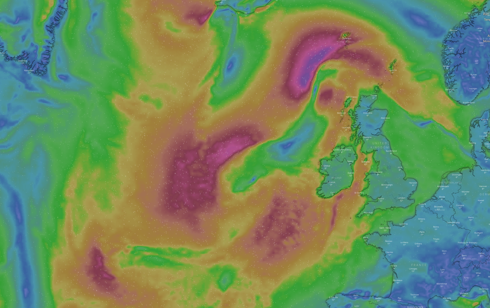

# Weather Downloader
Simple node script to download and archive images for a auto-refreshing weather desktop background, using puppeteer to screenshot from [windy.com](windy.com), and a mac launchctl plist to auto-run on the hour.



## Installation
```bash
chmod +x ./weather-downloader.js
mkdir -p ~/Library/LaunchAgents
cp ./local.WeatherDownloader.plist ~/Library/LaunchAgents/
launchctl load -w ~/Library/LaunchAgents/local.WeatherDownloader.plist
```

## Run
```bash
yarn start
``` 
or
```bash
launchctl start local.WeatherDownloader
```